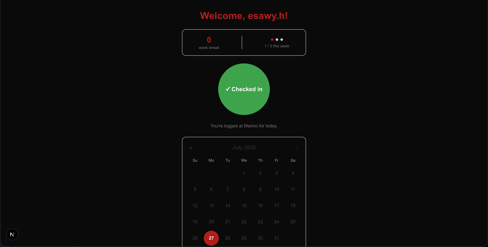

# HuskyLift 🐺

**Track your Marino gym attendance and build consistency.**

HuskyLift is a habit-tracking web app for Northeastern University students who work out at the Marino Recreation Center. It's built on one idea — the *"Duolingo of campus fitness"*: make showing up rewarding and keep students consistent. Check in with one tap, and watch your streak, calendar, and stats grow.

It is intentionally **not** a workout logger — no sets, reps, or exercise databases. Just the smallest thing that helps students actually show up.

🔗 **Live:** https://huskylift.vercel.app

## Features

- **Northeastern-only accounts** — sign-up is restricted to `@northeastern.edu` email addresses
- **One-tap check-in** — record a gym visit in a single tap
- **Attendance calendar** — a month view with visited days highlighted, plus navigation through past months
- **Weekly-goal streak** — consecutive weeks you hit your goal (default 3×/week), with live "this week" progress
- **Stats** — total visits and visits this month
- **Installable PWA** — add it to your phone's home screen and launch it full-screen like a native app

## Tech Stack

- **Framework:** Next.js (App Router) + TypeScript
- **Styling:** Tailwind CSS
- **Backend & Auth:** Supabase (PostgreSQL + Supabase Auth)
- **Hosting:** Vercel

## Notable Technical Decisions

The interesting part of this project wasn't the CRUD — it was the product and data-model choices:

- **Weekly streaks, not daily.** A daily "don't break the chain" streak (à la Duolingo) punishes rest days, which are part of healthy training. HuskyLift instead counts consecutive *weeks* that meet a goal, and never penalizes an in-progress week — rewarding real consistency rather than overtraining.
- **Invariants enforced in the database.** "One visit per day" isn't checked in app code — it's a `UNIQUE` constraint on a **generated, timezone-aware** `visit_date` column (derived from the check-in timestamp in the gym's local time). The rule can't be violated, and the constraint doubles as a performance index.
- **Row Level Security.** Every table is protected by RLS policies, so users can only ever read or write their *own* rows — access is enforced at the database, not just the API layer.
- **Derived, never stored.** Streaks and totals are computed from the raw check-in rows on every render. There's no `streak` column to fall out of sync — a single source of truth.
- **Server-side auth.** The homepage decides on the *server* whether you're logged in and redirects accordingly (no client-side flicker), with middleware that keeps sessions refreshed across the app.

## Database Schema

Two tables plus a trigger:

- **`profiles`** — extends each Supabase Auth user with app data (such as their weekly goal). A trigger automatically creates a profile row on sign-up.
- **`check_ins`** — one row per gym visit, governed by the `UNIQUE (user_id, visit_date)` rule described above.

The full schema, including all Row Level Security policies, lives in [`schema.sql`](./schema.sql).

## Running Locally

**Prerequisites:** Node.js 18+ and a free [Supabase](https://supabase.com) project.

1. Clone and install:
   \`\`\`bash
   git clone https://github.com/YOUR-USERNAME/huskylift.git
   cd huskylift
   npm install
   \`\`\`
2. In your Supabase project's SQL Editor, run the contents of \`schema.sql\` to create the tables.
3. Create a \`.env.local\` file in the project root:
   \`\`\`
   NEXT_PUBLIC_SUPABASE_URL=your-supabase-url
   NEXT_PUBLIC_SUPABASE_PUBLISHABLE_KEY=your-supabase-publishable-key
   \`\`\`
4. Start the dev server:
   \`\`\`bash
   npm run dev
   \`\`\`
   Open http://localhost:3000.

## Roadmap

- **V1 (current)** — accounts, one-tap check-in, calendar, weekly streak, and stats.
- **V2 — Social** — friends, friend streaks, monthly leaderboards, badges, and milestone sharing.
- **V3 — Community** — campus-wide challenges, club competitions, and a knowledge-sharing hub for Marino-specific tips and beginner advice: a supportive fitness community, not another social feed.

---

Built by Hosam Esawy.
